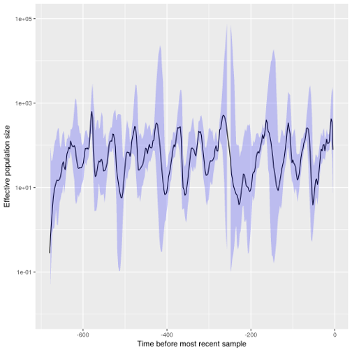
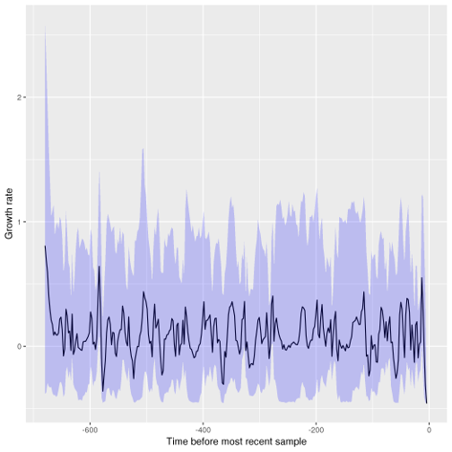

# skygrowth

[Phylodynamic inference](http://journals.plos.org/ploscompbiol/article?id=10.1371/journal.pcbi.1002947)  of effective population size for time-scaled phylogenies. Inference makes use of Bayesian Gibbs-within-Metropolis MCMC and fast maximum a posteriori algorithms. The growth rate of effective population size is modeled as a simple Brownian motion process. 

This package includes functions for
* incorporating time-varying covariates into phylodynamic inference. This is appropriate if the covariate is expected to alter the growth rate of effective population size
* computing the reproduction number (expected number of offspring) through time given prior information about the generation interval

## To cite

Erik Volz and Xavier Didelot, __Modeling the growth and decline of pathogen effective population size provides insight into epidemic dynamics and drivers of antimicrobial resistance__, Submitted 2017

## H3N2 influenza in New York
This data set is provided in the phylodyn R package by Karcher et al. 
It is based on 12 consecutive seasonal influenza seasons in NY state up to 2004. 

```r
require(skygrowth)
require(ape)
require(ggplot2)
load(system.file( 'NY_flu.rda', package='skygrowth')  )
(tr <- NY_flu) # NOTE branch lengths in weeks  / 13 years in all
```

```
## 
## Phylogenetic tree with 709 tips and 708 internal nodes.
## 
## Tip labels:
## 	CY000001date568.3, CY000009date563.9, CY000017date565.7, CY000025date565.3, CY000033date571.0, CY000041date565.9, ...
## 
## Rooted; includes branch lengths.
```

```r
fit <- skygrowth.map( tr 
 , res = 24*13  # Ne changes every 2 weeks
 , tau0 = .1    # Smoothing parameter. If prior is not specified, this will also set the scale of the prior
)
```

```r
plot( fit ) 
```


We can compare this to the standard skyride model: 

```r
require(phylodyn)
```
```r
b0 <- BNPR( tr )
plot_BNPR( b0 )
```


We can also run the slower MCMC version which should provide more accurate CIs:
```r
mcmcfit <- skygrowth.mcmc( tr, res = 24*13, tau0=.1 )
plot( mcmcfit )  + scale_y_log10(limits=c(.01, 1e5))
```



And we can visualise the growth rate through time:
```r
growth.plot( mcmcfit )
```


